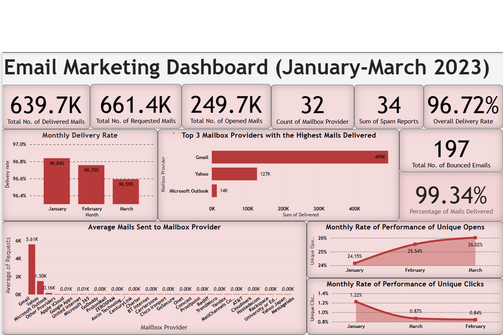
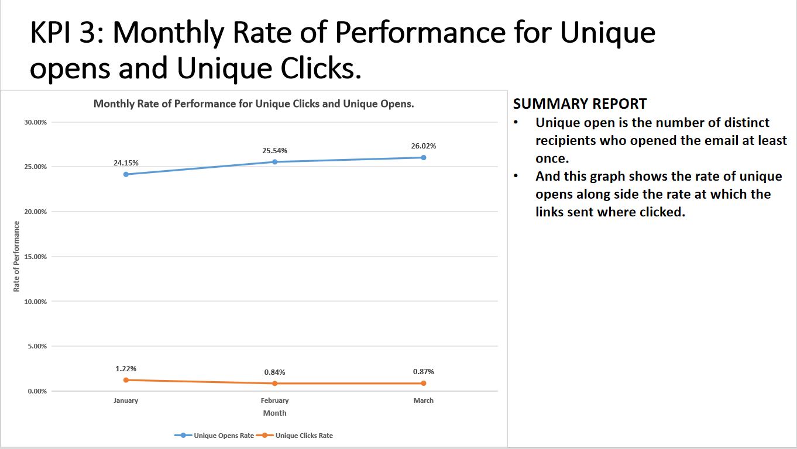
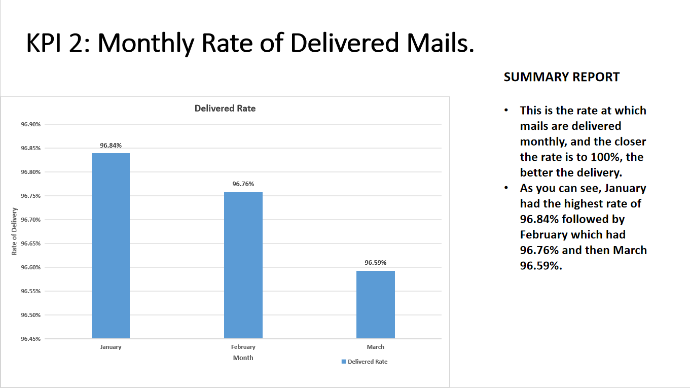

# email_marketing_campaign
Data analytics project assessing the deliverability and engagement performance of a large-scale email marketing campaign. Includes insights and recommendations based on KPI trends.
# 📊 Email Marketing Campaign Performance (Q1 2023)

**Author:** Samuel Kwadwo Boateng Bonsu  
**Project Type:** Internship Project  
**Date:** February 2025  
**Tools Used:** PowerPoint, Excel (assumed), Basic Data Analysis, SQL, PowerBI

---

## 📝 Project Overview

This project analyses an **Email Marketing Campaign's performance** from January to March 2023. The purpose was to evaluate how effectively emails were delivered, opened, clicked, or blocked by different mailbox providers like Gmail, Yahoo, and Outlook. This was part of an internship assessment to develop practical data analysis and reporting skills.

---

## 📌 Key KPIs Analyzed

- 📬 **Delivery Rate** by mailbox provider (monthly)
- 📉 **Bounce Rate**, **Block Rate**, and **Unsubscribe Rate**
- 📈 **Unique Open Rate** and **Unique Click Rate**
- 📤 **Total Emails Processed vs Delivered**

---

## 📈 Key Insights

- Gmail had the highest number of emails received.
- The **average delivery rate was over 96%** across the 3-month period.
- **Carrierzone** experienced the highest **block rate**, while **GoDaddy** had the highest **bounce rate**.
- Spam reports were generally low but slightly higher for providers with larger volumes.
- Engagement (clicks and opens) was relatively low, indicating room for improvement in content strategy.

---

## ✅ Recommendations

To improve email deliverability and engagement:

- Avoid spam trigger words like **“free”**, **“urgent”**, and **“buy now”**.
- Validate and clean email lists to prevent invalid addresses.
- Balance text and images within emails to avoid spam filters.
- Limit over-sending and monitor reputation with mailbox providers.
- Study other companies’ strategies to benchmark effective practices.

---

## 🔚 Conclusion

Out of **643,988 emails sent**, **99.34% were successfully delivered**, with a very low bounce and block rate. However, low click and open engagement shows the need for better email content and targeting strategies.

This project helped develop practical skills in:

- Reading and interpreting email campaign performance data
- Reporting insights using visuals
- Making strategic recommendations based on data

---
## Visuals
### Dashboard

### KPI 3

### KPI 2

